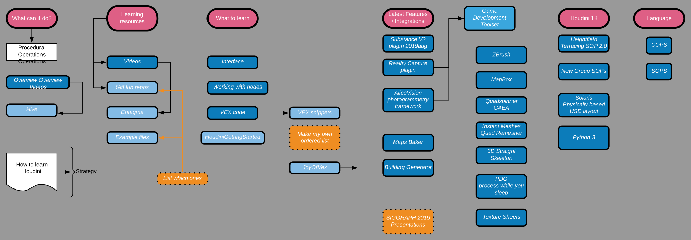
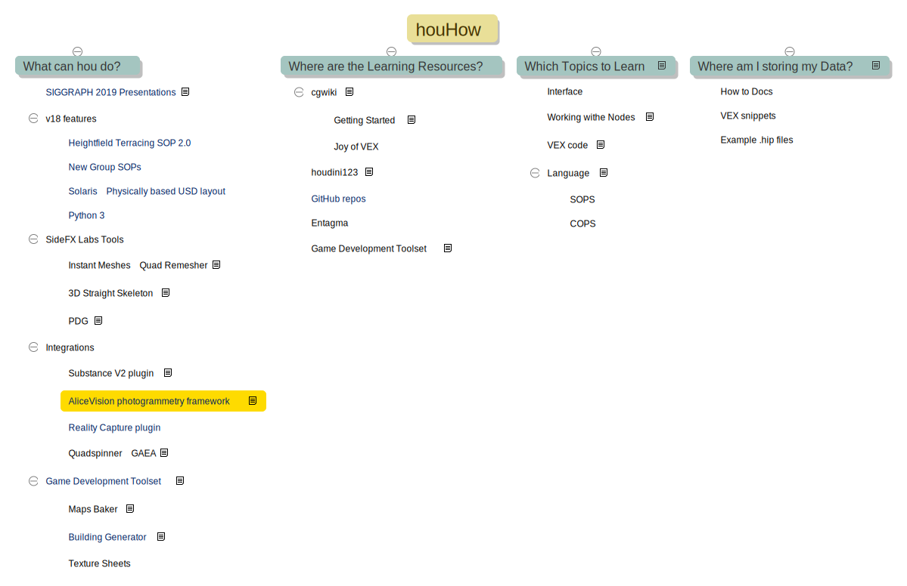

# houHow
My structured WIP plan to learn Houdini.

---
## Finding a suitable Markdown editor / outliner
If I am going to collate & document & process from lots of different sources a bespoke plan, I am going to need tools that allow me to document & organise the written documents, online tutorial videos, snippets of VEX code etc... so I will do this using markdown files stored in a repository on Github.

### Currently using `gitnote` on this Github repo
I am testing in MacOS now, and there is a Windows installer & a portable that I need to test.
- On Android & IOS I will have to find a solution to easily edit the markdown files and sync  them to the Github repo.

### History
Originally started this plan in LucidChart, mapping the outline as a diagram and adding notes and links as comments of the nodes.  Files could be edited in the browser/IOS app/Android app, and stored in Google Drive (so not bad, cross platform & data accessable from anywhere as LucidChart has a Google Drive integration also). I ran into some issues that bothered & limited me (to the point where I didn't want to put all my eggs in one proprietry format):

1. free version has a node limitation
2. comment icons were huge when zoomed out (birdseye view)
3. my notes/comments were stored inline

So I started looking at other software that combined mindmaps and markdown creation.  The mindmap would be great for laying out an outline of topics and restructing them, and markdown is a clean way to add text, links, images and videos (youtube & vimeo).

I started researching I found the following:

#### [gitnote](https://github.com/zhaopengme/gitnote) - A modern note taking app based on GIT.
- This is nice, the workflow inside `gitnote` is clone a repo (The repo folder structure is visble as a tree, with an split pane for editing and preview).
- `gitnote` has extensions for `grapheditor` which creates diagrams/flowcharts/UML and `kityminder`which creates mindmaps (and can import/export markdown files).  The diagrams & mindmaps created all live in the local `git` repo, and are synced to the cloned source.
- it uses <https://github.com/fex-team/hotbox> for a nide radial right click menu when editing mindmaps in `kityminder`.
- I had to edit some files and Google translate a few Chinese menus to english > `/Users/username/.gitnote/plugins/kityminder/lib/kityminder.editor/kityminder.editor.min.js`

#### [NoteLynX Pro](https://play.google.com/store/apps/details?id=com.astrodean.notelynxpro&hl=en_GB) - 3-in-1 Outliner, Mindmap and Personal Wiki. An Outliner for Hierarchical Lists, a Mindmap for Graphical Tree View and embedded Hyperlinks to cross reference your notes.
- I haven't tried this yet (paid)

#### [markdown-mindmap](https://atom.io/packages/markdown-mindmap) - Visualize markdown files as mindmaps in Atom editor
- I haven't tried this yet

#### [WriteMapper 2](https://writemapper.com/) - The content writing tool for visual thinkers to quickly and easily produce text documents using mind maps.
- I haven't tried this fully yet, (paid expensive), just does mindmap & markdown editing - seems a little basic, so I need to spend more time on the 7 day trial.

#### [Curio 13](https://www.zengobi.com/curio/) - Curio is an intuitive, freeform notebook environment with all the integrated tools you need to take notes, brainstorm ideas, collect research, and organize your tasks and documents.
- I downloaded the trial, appears to have everything somewhere, very complex sofware, I may need to spend more time with this to see if the output is proprietry.

#### [MindForger](https://www.mindforger.com/) - Thinking Notebook & Markdown IDE.
- This seems amazing for restructuring, but useage is very difficult. Finding a way to use this precise tool appears difficult, with many features hidden away (maybe linked to a heavy keyboard shortcut workflow).
- I need to spend more time in this totally free app.

#### [TiddlyMap](http://tiddlymap.org/) - Map drawing and topic visualization for your TiddlyWiki (a non-linear personal web notebook).
- The motivation behind TiddlyMap is to combine the strengths of wikis and concept maps in the realms of personal knowledge management in a single application.
- This may end up being a winner, as the split screen wiki editor with node editor seems great.
- I wish this was a standalone app
- I need to spend more time in this totally free solution that `currently` runs in the browser.
- `UPDATE:`<https://noteself.github.io/> and this link to get it working <https://forum.noteself.org/t/tw-5-1-19-noteself-and-tiddlymap-together/187>

<iframe width="720" height="432" src="https://www.youtube.com/embed/dmeIxuN0L5w?start=279" frameborder="0" allow="accelerometer; autoplay; encrypted-media; gyroscope; picture-in-picture" allowfullscreen></iframe>

#### [MacDown](https://macdown.uranusjr.com/history/testing/)
For straight editing of .md files with a split preview, I like & use the free MacDown app version `0.7.2d137`
- I downloaded from here <https://macdown.uranusjr.com/history/testing/>

---
### other links
https://www.reddit.com/r/bearapp/comments/8dbzyr/feature_request_mindmap_with_tabs/

https://tobloef.com/text2mindmap/

---
### embed videos

