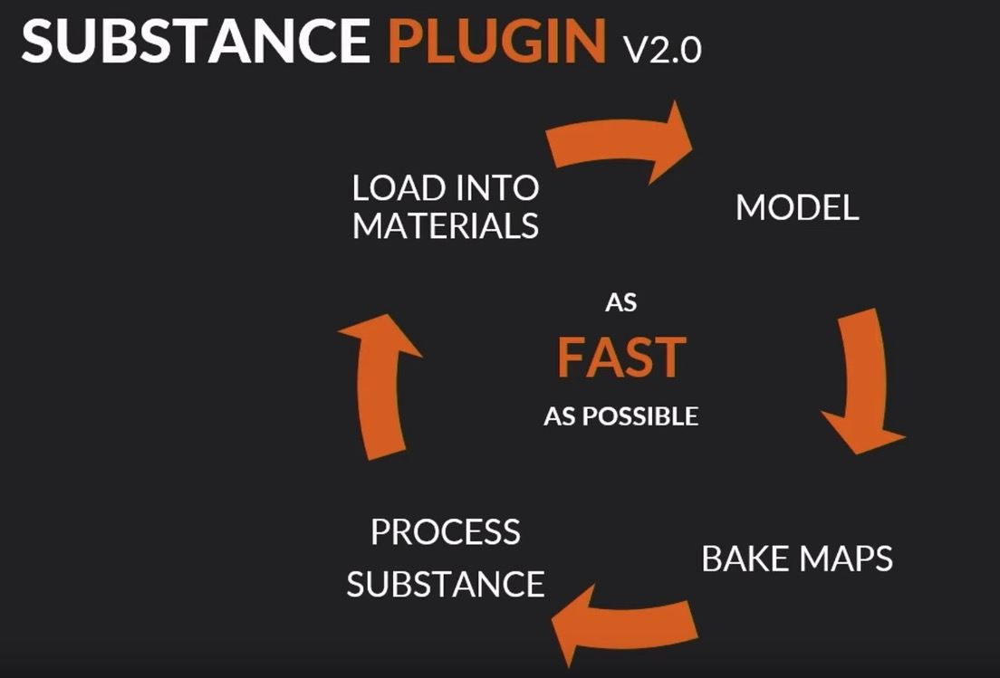

# houHow

## What can hou do?

### SIGGRAPH 2019 Presentations

[houdini hive Siggraph 2019 presentations](https://www.sidefx.com/community/houdini-hive-sigg2019-presentations/)

### v18 features

#### Heightfield Terracing SOP 2.0

#### New Group SOPs

#### Solaris
 Physically based USD layout

#### Python 3

### SideFX Labs Tools

#### Instant Meshes
 Quad Remesher

[VIDEO](https://youtu.be/7X-r_XarMLI?t=1512)

- Use the Stroke SOP to draw guide curves and feed them back as an influence.

#### 3D Straight Skeleton

[VIDEO](https://youtu.be/7X-r_XarMLI?t=1637)

#### PDG


Procedural Dependency Graph to automate workflows./ pipelines.
- process while you sleep

### Integrations

#### Substance V2 plugin



- COPS based, so Substance nodes can be used anywhere in Houdini.
- [youtube](https://youtu.be/7X-r_XarMLI?t=1471)

<iframe width="800" height="480" src="https://www.youtube.com/embed/7X-r_XarMLI?start=1435" frameborder="0" allow="accelerometer; autoplay; encrypted-media; gyroscope; picture-in-picture" allowfullscreen></iframe>

- workflow = Make a Substance archive (Spark), expose parameters, then load them in COPS.
- [youtube](https://www.youtube.com/watch?v=7X-r_XarMLI&feature=youtu.be&t=1821)

<iframe width="800" height="480" src="https://www.youtube.com/embed/7X-r_XarMLI?start=1821" frameborder="0" allow="accelerometer; autoplay; encrypted-media; gyroscope; picture-in-picture" allowfullscreen></iframe>

#### AliceVision photogrammetry framework
AliceVision is a Photogrammetric Computer Vision Framework which provides a 3D Reconstruction and Camera Tracking algorithms. It has been made available as a plugin Houdini through the GameDevelopmentToolset.

[VIMEO](https://vimeo.com/318335199)

[SIDEFX tutorials alicevision-plugin/](https://www.sidefx.com/tutorials/alicevision-plugin/)

<iframe src="https://player.vimeo.com/video/318335199" width="800" height="450" frameborder="0" allow="autoplay; fullscreen" allowfullscreen></iframe>
<p><a href="https://vimeo.com/318335199">[TUTORIAL] Game Tools | AliceVision</a> from <a href="https://vimeo.com/ambrosiussen">Paul Ambrosiussen</a> on <a href="https://vimeo.com">Vimeo</a>.</p>

<div class="sketchfab-embed-wrapper">
    <iframe title="A 3D model" width="800" height="480" src="https://sketchfab.com/models/791850b543fe4616b26a08bbc0134bad/embed" frameborder="0" allow="autoplay; fullscreen; vr" mozallowfullscreen="true" webkitallowfullscreen="true"></iframe>

<p style="font-size: 13px; font-weight: normal; margin: 5px; color: #4A4A4A;">
    <a href="https://sketchfab.com/3d-models/wooden-lion-791850b543fe4616b26a08bbc0134bad?utm_medium=embed&utm_source=website&utm_campaign=share-popup" target="_blank" style="font-weight: bold; color: #1CAAD9;">Wooden Lion</a>
    by <a href="https://sketchfab.com/AliceVision?utm_medium=embed&utm_source=website&utm_campaign=share-popup" target="_blank" style="font-weight: bold; color: #1CAAD9;">AliceVision</a>
    on <a href="https://sketchfab.com?utm_medium=embed&utm_source=website&utm_campaign=share-popup" target="_blank" style="font-weight: bold; color: #1CAAD9;">Sketchfab</a>
</p>
</div>

#### Reality Capture plugin 

#### Quadspinner
 GAEA

Node based terrain editing tool. It exposes parameters from Gaea software. CommandLine Bride - Bundled TOR graphs - Custom TOR support. SideFX will start to bundle some standard TOR graphs like erosion, and some filters.

- SOP - Gaea Erosion node
- You can use Gaea Pro $199 or Enterprise $299 perpetual version

### Game Development Toolset

Game Development Toolset will become SideFX Labs.

#### Maps Baker

COPS - It can bake a 4K map in 9 seconds. Curvature, Normal maps etc...

- It has an autobaker which can be automated with PDG. [VIDEO](https://youtu.be/7X-r_XarMLI?t=1947)

#### Building Generator

[sidefx building generator tutorial](https://www.sidefx.com/tutorials/building-generator/)

#### Texture Sheets

## Where are the Learning Resources?

### cgwiki

tokeru

- one
- two

[goo](http://google.com)

#### Getting Started

[CGwiki Houdini Getting Started](http://www.tokeru.com/cgwiki/index.php?title=HoudiniGettingStarted)

#### Joy of VEX

### houdini123

Working on procedural modelling allows insgtant feedback whilst becoming familar with the many nodes and how to connect them in networks.

### GitHub repos

### Entagma

### Game Development Toolset 

[Tutorials LINK](https://www.sidefx.com/tutorials/game-development-toolset-overview/)

## Which Topics to Learn


### Interface

### Working withe Nodes

Create a step by step list of actions to data.  Using nodes with attributes, and or VEX code tp procedurally operate on data points.

### VEX code

```ruby
require 'redcarpet'
markdown = Redcarpet.new("Hello World!")
puts markdown.to_html
```

### Language

Cookling Recipes, resolving a Network of Nodes > digital assets (Tools) = Pipeline in a Box.

#### SOPS

#### COPS

## Where am I storing my Data?

Github Repo stored locally in my G: Google File Stream.

### How to Docs

### VEX snippets

### Example .hip files

