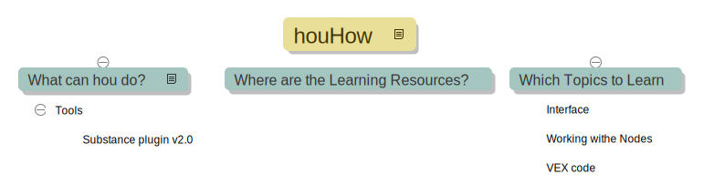

# houHow

## What can hou do?

### Tools

#### Substance plugin v2.0

## Where are the Learning Resources?

### cgwiki

tokeru

- one
- two

[goo](http://google.com)

## Which Topics to Learn

### Interface

### Working withe Nodes

### VEX code

'''
for
'''
